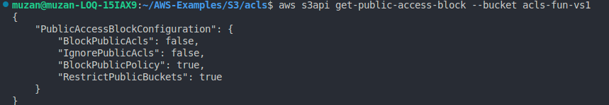
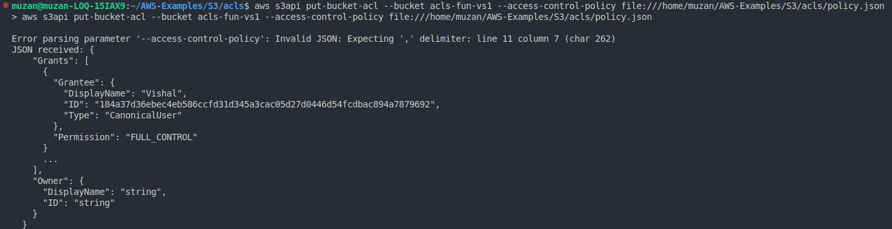

# AWS S3 Bucket ACL Management

This document contains the AWS CLI commands used to manage S3 Bucket Access Control Lists (ACLs) and Public Access settings.

### Documentation for Full Commands

For more details on AWS CLI S3 commands, refer to the official [AWS CLI Documentation](https://docs.aws.amazon.com/cli/latest/reference/s3api/#cli-aws-s3api).

---

## Create a Bucket

To create a new S3 bucket, use the following command:

```sh
aws s3api create-bucket --bucket acls-fun-vs1
```

This command creates a bucket named acls-fun-vs1.


---

## Turn off Block Public Access for ACLs

To disable block public access for ACLs, use this command:
### Documentation:
For detailed information, refer to the [AWS CLI Put Public Access Block Documentation](https://docs.aws.amazon.com/cli/latest/reference/s3api/put-public-access-block.html)

```sh
aws s3api put-public-access-block \
--bucket acls-fun-vs1 \
--public-access-block-configuration "BlockPublicAcls=false,IgnorePublicAcls=false,BlockPublicPolicy=true,RestrictPublicBuckets=true"
```

This command configures the bucket to allow public ACLs and ignore public ACLs while restricting public policies and bucket access.

---

## Get the Head of Public Access Config
To retrieve the current public access block configuration for the bucket:
```sh
aws s3api get-public-access-block --bucket acls-fun-vs1
```


This command provides the public access block settings for the bucket acls-fun-vs1.

### OUTPUT 



For detailed information, refer to the [AWS CLI Put Public Access Block Documentation](https://docs.aws.amazon.com/cli/latest/reference/s3api/put-public-access-block.html)


---

## Change Bucket Ownership
By default, you may not have full ownership of an S3 bucket. To change the ownership and ensure full control over the bucket, use the following command:

### Documentation:
For more information, visit the [Put Bucket ACL Documentation](https://awscli.amazonaws.com/v2/documentation/api/latest/reference/s3api/put-bucket-acl.html)

```sh
aws s3api put-bucket-ownership-controls \
--bucket acls-fun-vs1 \
--ownership-controls="Rules=[{ObjectOwnership=BucketOwnerPreferred}]"
```

This command sets the ownership control rule to BucketOwnerPreferred, giving you full ownership of objects in the bucket.

---

## Change ACL to Allow for a User in Another AWS Account
To change the Access Control List (ACL) and allow access for a user in another AWS account, use the following command:

### Documentation:
For more information, [refer to the Put Bucket ACL Documentation](https://awscli.amazonaws.com/v2/documentation/api/latest/reference/s3api/put-bucket-acl.html).
```sh
aws s3api put-bucket-acl --bucket acls-fun-vs1 --access-control-policy file:///home/muzan/AWS-Examples/S3/acls/policy.json
```

This command applies a custom ACL policy from a JSON file located at /home/muzan/AWS-Examples/S3/acls/policy.json.

### OUTPUT 


---

## Access the Bucket from Another AWS Account
To upload a file to the S3 bucket and list its contents, use the following commands:
```sh
touch bootcamp.txt
aws s3 cp bootcamp.txt s3://acls-fun-vs1
aws s3 ls s3://acls-fun-vs1
```

These commands create a file named bootcamp.txt, upload it to the S3 bucket acls-fun-vs1, and list the contents of the bucket.

---

## Cleanup

To remove all created files and the bucket, use the following commands:

```sh
aws s3 rm s3://acls-fun-vs1/bootcamp.txt
aws s3 rb s3://acls-fun-vs1
```
---

# Documentation for JSON
For detailed information about ACL policies in JSON format, refer to the [Put Bucket ACL Documentation](https://docs.aws.amazon.com/cli/latest/reference/s3api/put-bucket-acl.html).