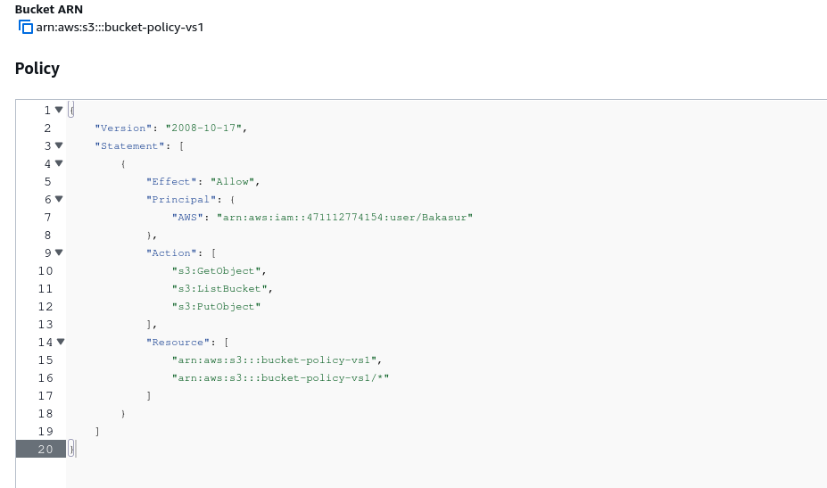

# AWS S3 Bucket Policy Example

This guide demonstrates how to set up an S3 bucket, attach a bucket policy, and access it from another AWS account.

---

## Step 1: Create a Bucket

Run the following command to create an S3 bucket:

```bash
aws s3 mb s3://bucket-policy-vs1
```
This command creates a bucket named ```bucket-policy-vs1```.

---

## Step 2: Create and Attach a Bucket Policy

 1. Prepare your bucket policy JSON file. For example, save the policy as policy.json in the directory ```/home/muzan/AWS-Examples/S3/bucket-policy/```.
 2. Use the following command to attach the policy to your bucket:
 ```sh
 aws s3api put-bucket-policy --bucket bucket-policy-vs1 --policy file:///home/muzan/AWS-Examples/S3/bucket-policy/policy.json
```
Once executed successfully, your bucket will have the defined permissions.

### Useful Documentation:
- [AWS CLI Command: ```put-bucket-policy```](https://docs.aws.amazon.com/cli/latest/reference/s3api/put-bucket-policy.html)
- [AWS S3 User Guide: Managing Access](https://docs.aws.amazon.com/AmazonS3/latest/userguide/example-walkthroughs-managing-access-example2.htmll)

---


## Step 3: Access the Bucket from Another Account
To test access from another AWS account, perform the following steps:
1. Create a sample file:
```sh 
touch hello.txt
```

2. Upload the file to the bucket:
```sh
aws s3 cp hello.txt s3://bucket-policy-vs1
```

3. List the contents of the bucket to verify the upload:
```sh
aws s3 ls s3://bucket-policy-vs1
```

## Example Output
Below is an example of the commands being executed:



---

## Cleanup

To remove all created files and the bucket, use the following commands:

```sh
aws s3 rm s3://bucket-policy-vs1/hello.txt
aws s3 rb s3://bucket-policy-vs1
``` 

--
--
## Additional Resources
For more details, refer to the official AWS documentation:

- [AWS CLI Command: ```put-bucket-policy```](https://docs.aws.amazon.com/cli/latest/reference/s3api/put-bucket-policy.html)
- [AWS S3 User Guide: Managing Access](https://docs.aws.amazon.com/AmazonS3/latest/userguide/example-walkthroughs-managing-access-example2.htmll)
