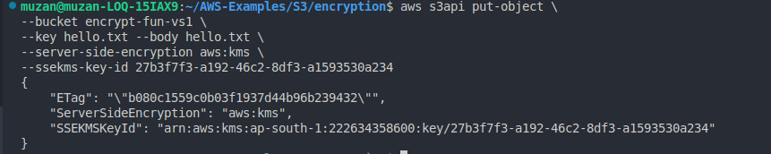
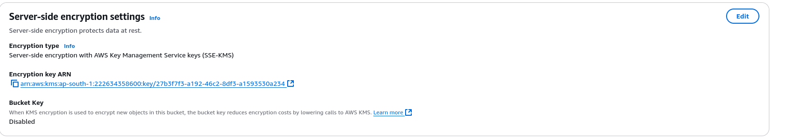

## Create a bucket

```sh
aws s3 mb s3://encrypt-fun-vs1
```

## Create a file  

```sh
echo "hello world" > hello.txt
aws s3 cp hello.txt s3://encrypt-fun-vs1
```

### Put object with encryption of KMS
```sh
aws s3api put-object \
--bucket encrypt-fun-vs1 \
--key hello.txt --body hello.txt \
--server-side-encryption aws:kms \
--ssekms-key-id 27b3f7f3-a192-46c2-8df3-a1593530a234
```



## Command to check existing keys
```sh
aws kms list-keys
```


---


### Put Object with SSE-C [Failed Attempt]

First create openssl key 
```sh
export BASE64_ENCODED_KEY=$(openssl rand base64 32) 
echo $BASE64_ENCODED_KEY
```

Create md5 value from BASE64_ENCODED_KEY
```sh
export MD5_VALUE=$(echo -n $BASE_ENCODED_KEY | md5sum | awk '{print $1}' | base64 -w0)
echo $MD5_VALUE
```

```sh
aws s3api put-object \
--bucket encrypt-fun-vs1 \
--key hello.txt --body hello.txt \
--sse-customer-algoritm AES256 \
--sse-customer-key $BASE64_ENCODED_KEY \
--sse-customer-md5 $MD5_VALUE
```
This command is having some MD5 hash issue, If you know the error , let me know
Error - An error occurred (InvalidArgument) when calling the PutObject operation: The calculated MD5 hash of the key did not match the hash that was provided.


---


## Put Object with SSE-C via aws s3
Documentation for this

https://catalog.us-east-1.prod.workshops.aws/workshops/aad9ff1e-b607-45bc-893f-121ea5224f24/en-US/s3/serverside/ssec

This will create Key and save it in ssec.key
```sh
openssl rand -out ssec.key 32
```


This will upload the file on s3 with encrypted key 
```sh
aws s3 cp hello.txt s3://encrypt-fun-vs1/hello.txt
--sse-c AES256
--sse-c-key fileb://ssec.key
```


To download the file again, You will need the key
```sh
aws s3 cp s3://encrypt-fun-vs1/hello.txt hello.txt \
--sse-c AES256 
--sse-c-key fileb://ssec.key
```


## Cleanup

To remove all created files and the bucket, use the following commands:


### Cleanup Everything 
```sh
aws s3 rm s3://encrypt-fun-vs1/hello.txt
aws s3 rb s3://encrypt-fun-vs1
```