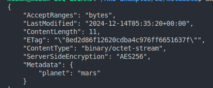
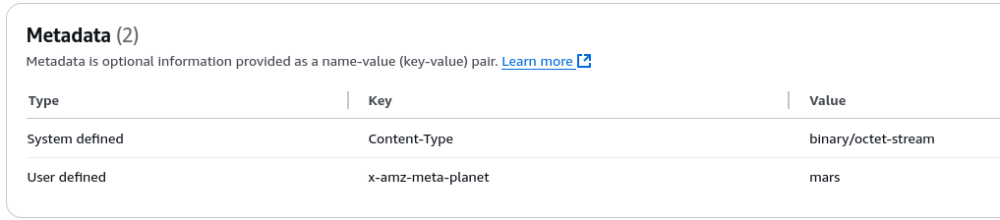
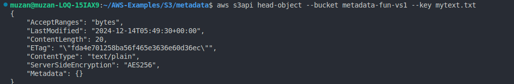
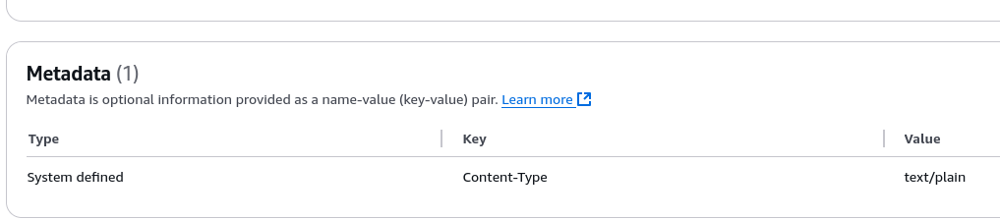
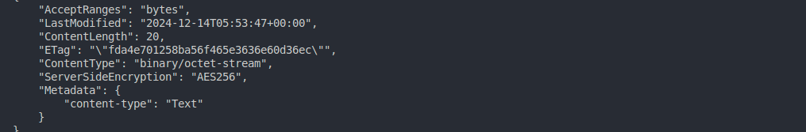
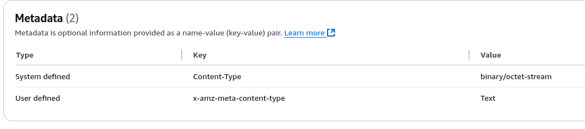

# AWS S3 Metadata Examples

## Create a Bucket

To create a new S3 bucket, use the following command:

```sh
aws s3 mb s3://metadata-fun-vs1
```

## Create an Object

Create a simple text file:

```sh
echo "Hello Mars" > hello.txt
```

### Upload Object with User-Defined Metadata

Upload the text file to the bucket with user-defined metadata:

```sh
aws s3api put-object --bucket metadata-fun-vs1 --key hello.txt --body hello.txt --metadata PLANET=mars
```

### CLI Output after Creating Metadata



### Console Image after Creating Metadata



## Create a New File for System-Defined Metadata

Create another text file:

```sh
echo "this is a text file" > mytext.txt
```

## Upload Object with System-Defined Metadata

Upload the file to the bucket with a system-defined metadata value for content type (set to `text/plain`):

```sh
aws s3api put-object --bucket metadata-fun-vs1 --key mytext.txt --body mytext.txt --content-type text/plain
```

## Get Head of the Object

Retrieve metadata of the object:

```sh
aws s3api head-object --bucket metadata-fun-vs1 --key mytext.txt
```

### CLI Output After Changing System-Defined Metadata



### Console Image After Changing Content Type



---

### Note:

- The `--metadata` flag works for **user-defined metadata** only.
- If you attempt to use `--metadata` on **system-defined metadata**, it will create a **new user-defined key-value pair** instead of overriding the system-defined metadata.

### Metadata for Content-Type (CLI Output)



### Metadata for Content-Type (Console Output)


 
---

## Cleanup

To remove all created files and the bucket, use the following commands:

```sh
aws s3 rm s3://metadata-fun-vs1/mytext.txt
aws s3 rm s3://metadata-fun-vs1/hello.txt
aws s3 rb s3://metadata-fun-vs1
```
