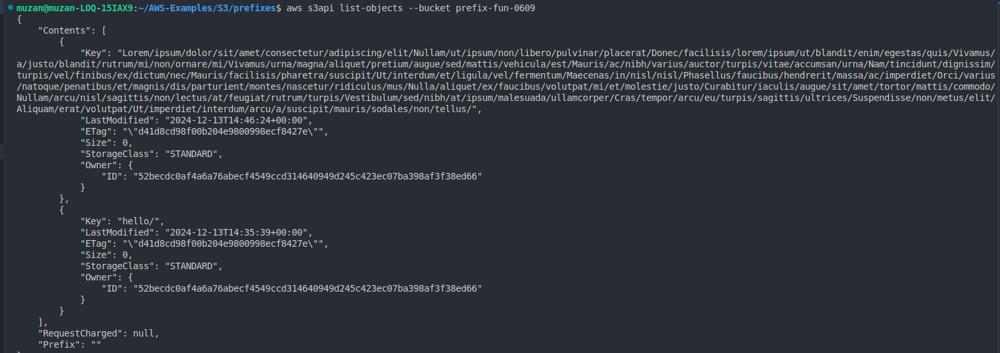

## Create our Bucket
```sh
aws s3 mb s3://prefix-fun-0609
```
## Create out Folder name "hello"
```sh
aws s3api  put-object --bucket="prefix-fun-0609" --key="hello/"
```

## Create many folders
```sh
aws s3api  put-object --bucket="prefix-fun-0609" --key="Lorem/ipsum/dolor/sit/amet/consectetur/adipiscing/elit/Nullam/ut/ipsum/non/libero/pulvinar/placerat/Donec/facilisis/lorem/ipsum/ut/blandit/enim/egestas/quis/Vivamus/a/justo/blandit/rutrum/mi/non/ornare/mi/Vivamus/urna/magna/aliquet/pretium/augue/sed/mattis/vehicula/est/Mauris/ac/nibh/varius/auctor/turpis/vitae/accumsan/urna/Nam/tincidunt/dignissim/turpis/vel/finibus/ex/dictum/nec/Mauris/facilisis/pharetra/suscipit/Ut/interdum/et/ligula/vel/fermentum/Maecenas/in/nisl/nisl/Phasellus/faucibus/hendrerit/massa/ac/imperdiet/Orci/varius/natoque/penatibus/et/magnis/dis/parturient/montes/nascetur/ridiculus/mus/Nulla/aliquet/ex/faucibus/volutpat/mi/et/molestie/justo/Curabitur/iaculis/augue/sit/amet/tortor/mattis/commodo/Nullam/arcu/nisl/sagittis/non/lectus/at/feugiat/rutrum/turpis/Vestibulum/sed/nibh/at/ipsum/malesuada/ullamcorper/Cras/tempor/arcu/eu/turpis/sagittis/ultrices/Suspendisse/non/metus/elit/Aliquam/erat/volutpat/Ut/imperdiet/interdum/arcu/a/suscipit/mauris/sodales/non/tellus/"
```

